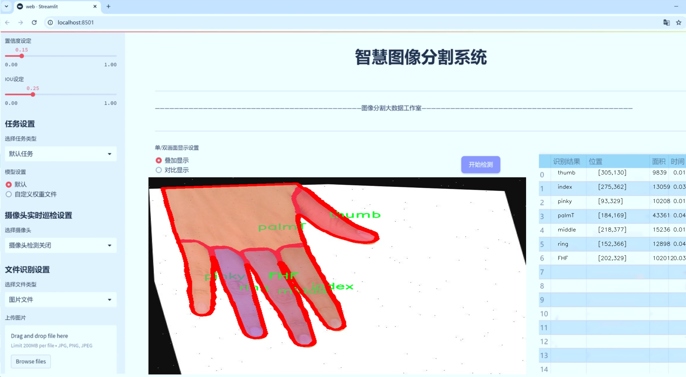
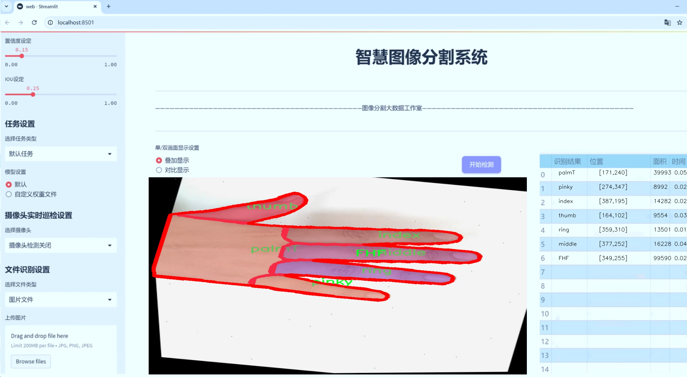
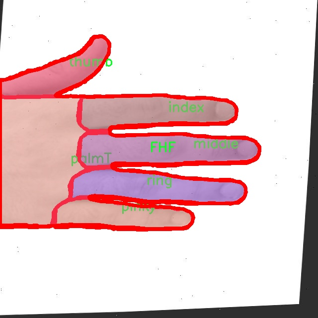
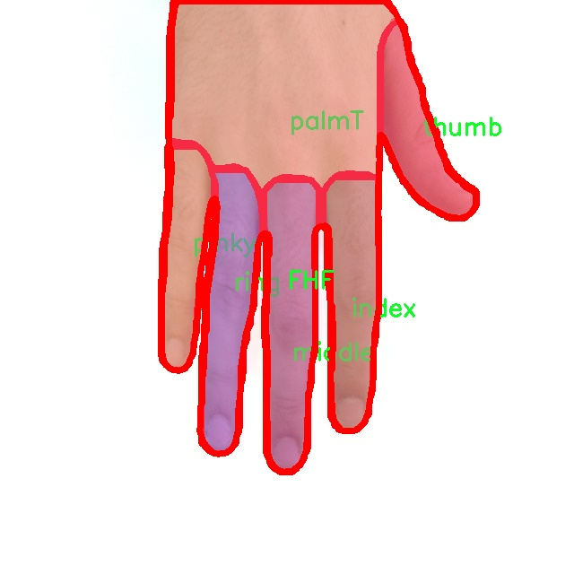
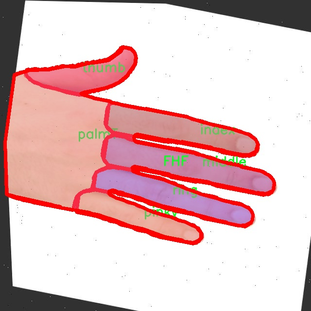
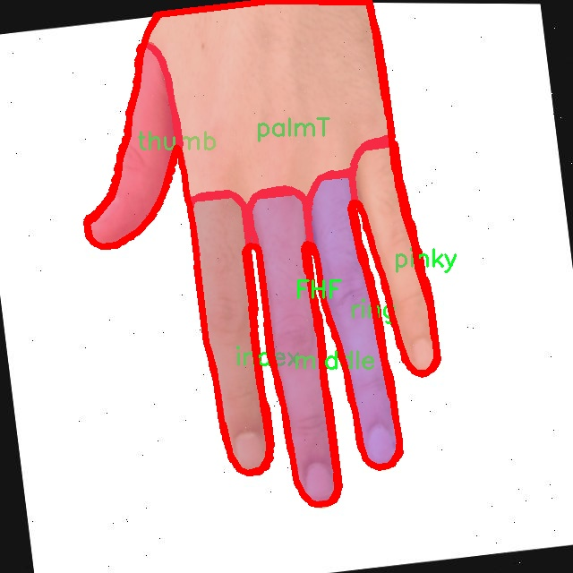
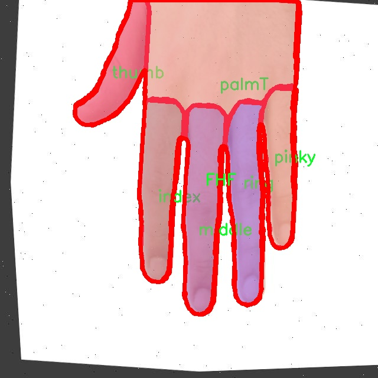

# 手掌区域姿势图像分割系统源码＆数据集分享
 [yolov8-seg-C2f-ODConv＆yolov8-seg-fasternet等50+全套改进创新点发刊_一键训练教程_Web前端展示]

### 1.研究背景与意义

项目参考[ILSVRC ImageNet Large Scale Visual Recognition Challenge](https://gitee.com/YOLOv8_YOLOv11_Segmentation_Studio/projects)

项目来源[AAAI Global Al lnnovation Contest](https://kdocs.cn/l/cszuIiCKVNis)

研究背景与意义

随着计算机视觉技术的迅猛发展，图像分割在各个领域的应用日益广泛，尤其是在手势识别、虚拟现实和人机交互等领域。手掌区域的姿势图像分割作为图像分割中的一个重要分支，具有重要的研究价值和应用前景。手掌的姿势不仅是人类与计算机交互的重要方式，也是表达情感和意图的关键手段。因此，开发高效、准确的手掌区域姿势图像分割系统，对于提升人机交互的自然性和智能化水平具有重要意义。

在众多图像分割算法中，YOLO（You Only Look Once）系列模型因其实时性和高效性而备受关注。YOLOv8作为该系列的最新版本，结合了深度学习的先进技术，能够在保证精度的同时，实现快速的图像处理。然而，传统的YOLOv8模型在处理复杂的手掌姿势时，仍然面临一些挑战，如对手掌区域的细节捕捉不足、对不同姿势的适应性差等。因此，基于改进YOLOv8的手掌区域姿势图像分割系统的研究，旨在通过对模型结构和算法的优化，提高手掌姿势的分割精度和鲁棒性。

本研究将使用一个包含2000张图像的数据集，涵盖10个不同的手掌姿势类别，包括FHB、FHF、index、jewel、middle、palmB、palmT、pinky、ring和thumb。这些类别的多样性为模型的训练提供了丰富的样本，有助于提升模型对各种手势的识别能力。通过对这些图像进行标注和分析，研究者可以深入理解手掌姿势的特征及其在不同场景下的表现，从而为改进YOLOv8提供数据支持。

此外，手掌区域的姿势图像分割系统不仅在学术研究中具有重要意义，也在实际应用中展现出广泛的前景。例如，在虚拟现实和增强现实中，用户的手势可以直接影响虚拟环境的交互体验；在医疗领域，手势识别技术可以辅助医生进行远程手术；在智能家居中，手势控制能够提升用户的操作便捷性。因此，基于改进YOLOv8的手掌区域姿势图像分割系统的研究，能够推动相关技术的发展，并为各行各业的智能化进程提供有力支持。

综上所述，基于改进YOLOv8的手掌区域姿势图像分割系统的研究，不仅有助于提升图像分割技术的精度和效率，也为手势识别的实际应用提供了新的思路和方法。通过对手掌姿势的深入研究，我们能够更好地理解人机交互的本质，推动智能技术的进一步发展。

### 2.图片演示






##### 注意：由于此博客编辑较早，上面“2.图片演示”和“3.视频演示”展示的系统图片或者视频可能为老版本，新版本在老版本的基础上升级如下：（实际效果以升级的新版本为准）

  （1）适配了YOLOV8的“目标检测”模型和“实例分割”模型，通过加载相应的权重（.pt）文件即可自适应加载模型。

  （2）支持“图片识别”、“视频识别”、“摄像头实时识别”三种识别模式。

  （3）支持“图片识别”、“视频识别”、“摄像头实时识别”三种识别结果保存导出，解决手动导出（容易卡顿出现爆内存）存在的问题，识别完自动保存结果并导出到tempDir中。

  （4）支持Web前端系统中的标题、背景图等自定义修改，后面提供修改教程。

  另外本项目提供训练的数据集和训练教程,暂不提供权重文件（best.pt）,需要您按照教程进行训练后实现图片演示和Web前端界面演示的效果。

### 3.视频演示

[3.1 视频演示](https://www.bilibili.com/video/BV1PuSEYWEJF/)

### 4.数据集信息展示

##### 4.1 本项目数据集详细数据（类别数＆类别名）

nc: 10
names: ['FHB', 'FHF', 'index', 'jewel', 'middle', 'palmB', 'palmT', 'pinky', 'ring', 'thumb']


##### 4.2 本项目数据集信息介绍

数据集信息展示

在现代计算机视觉领域，手掌区域姿势识别与图像分割技术的进步为人机交互、虚拟现实以及增强现实等应用提供了强有力的支持。为此，构建一个高质量的训练数据集显得尤为重要。本研究所采用的数据集名为“irt”，专门用于训练和改进YOLOv8-seg模型，以实现对手掌区域的精准图像分割。该数据集的设计旨在涵盖手掌的多种姿势和状态，以便为模型提供丰富的训练样本，从而提升其在实际应用中的表现。

“irt”数据集包含10个类别，具体类别包括：FHB（手掌前部）、FHF（手掌后部）、index（食指）、jewel（中指）、middle（无名指）、palmB（手掌底部）、palmT（手掌顶部）、pinky（小指）、ring（戒指指）、thumb（拇指）。这些类别的设置不仅反映了手掌的解剖结构，还考虑到了不同手势在交互中的重要性。例如，食指和拇指的动作常常用于指向和抓取，而中指和无名指则在手势表达中扮演着重要角色。通过对这些类别的细致划分，数据集能够为模型提供多样化的手势样本，进而提升其在复杂场景下的识别能力。

在数据集的构建过程中，确保每个类别样本的多样性和代表性是至关重要的。为此，数据集中的图像涵盖了不同的光照条件、背景环境以及手掌的各种姿势。这种多样性不仅有助于模型学习到手掌的不同特征，还能增强其对环境变化的适应能力。此外，数据集中的每个图像都经过精确的标注，确保模型在训练过程中能够获得准确的目标信息。这种高质量的标注是实现高效图像分割的基础。

在实际应用中，YOLOv8-seg模型将利用“irt”数据集进行训练，以提高其对手掌区域的分割精度。通过引入深度学习技术，模型能够自动提取手掌的特征，并对不同类别进行有效区分。尤其是在复杂的手势识别任务中，模型的实时性和准确性将直接影响用户体验。因此，数据集的构建不仅是技术实现的基础，更是提升系统性能的关键环节。

综上所述，“irt”数据集为手掌区域姿势图像分割系统的训练提供了坚实的基础。通过对手掌不同部分的细致划分和丰富的样本设计，该数据集能够有效支持YOLOv8-seg模型的训练与优化。未来，随着数据集的不断扩展和优化，预计将进一步推动手掌区域姿势识别技术的发展，为人机交互和智能系统的应用开辟新的可能性。











### 5.全套项目环境部署视频教程（零基础手把手教学）

[5.1 环境部署教程链接（零基础手把手教学）](https://www.bilibili.com/video/BV1jG4Ve4E9t/?vd_source=bc9aec86d164b67a7004b996143742dc)


[5.2 安装Python虚拟环境创建和依赖库安装视频教程链接（零基础手把手教学）](https://www.bilibili.com/video/BV1nA4VeYEze/?vd_source=bc9aec86d164b67a7004b996143742dc)

### 6.手把手YOLOV8-seg训练视频教程（零基础小白有手就能学会）

[6.1 手把手YOLOV8-seg训练视频教程（零基础小白有手就能学会）](https://www.bilibili.com/video/BV1cA4VeYETe/?vd_source=bc9aec86d164b67a7004b996143742dc)


按照上面的训练视频教程链接加载项目提供的数据集，运行train.py即可开始训练



     Epoch   gpu_mem       box       obj       cls    labels  img_size
     1/200     0G   0.01576   0.01955  0.007536        22      1280: 100%|██████████| 849/849 [14:42<00:00,  1.04s/it]
               Class     Images     Labels          P          R     mAP@.5 mAP@.5:.95: 100%|██████████| 213/213 [01:14<00:00,  2.87it/s]
                 all       3395      17314      0.994      0.957      0.0957      0.0843

     Epoch   gpu_mem       box       obj       cls    labels  img_size
     2/200     0G   0.01578   0.01923  0.007006        22      1280: 100%|██████████| 849/849 [14:44<00:00,  1.04s/it]
               Class     Images     Labels          P          R     mAP@.5 mAP@.5:.95: 100%|██████████| 213/213 [01:12<00:00,  2.95it/s]
                 all       3395      17314      0.996      0.956      0.0957      0.0845

     Epoch   gpu_mem       box       obj       cls    labels  img_size
     3/200     0G   0.01561    0.0191  0.006895        27      1280: 100%|██████████| 849/849 [10:56<00:00,  1.29it/s]
               Class     Images     Labels          P          R     mAP@.5 mAP@.5:.95: 100%|███████   | 187/213 [00:52<00:00,  4.04it/s]
                 all       3395      17314      0.996      0.957      0.0957      0.0845


### 7.50+种全套YOLOV8-seg创新点代码加载调参视频教程（一键加载写好的改进模型的配置文件）

[7.1 50+种全套YOLOV8-seg创新点代码加载调参视频教程（一键加载写好的改进模型的配置文件）](https://www.bilibili.com/video/BV1Hw4VePEXv/?vd_source=bc9aec86d164b67a7004b996143742dc)

### 8.YOLOV8-seg图像分割算法原理

原始YOLOv8-seg算法原理

YOLOv8-seg算法是YOLO系列中的最新进展，代表了目标检测和分割领域的一次重要突破。与其前身YOLOv5相比，YOLOv8在检测精度和速度上都实现了显著的提升，尤其是在复杂场景下的表现。该算法的设计不仅关注于检测的准确性，还考虑到实时性和模型的轻量化，使其在实际应用中更具实用性。

YOLOv8-seg的网络结构由四个主要部分组成：输入端、骨干网络、颈部网络和头部网络。输入端的设计采用了马赛克数据增强、自适应锚框计算和自适应灰度填充等技术，以提高模型的鲁棒性和适应性。马赛克数据增强通过将多张图像拼接在一起，增加了训练样本的多样性，帮助模型更好地学习到不同场景下的特征。而自适应锚框计算则使得模型能够根据输入图像的特征动态调整锚框，提高了目标检测的准确性。

在骨干网络部分，YOLOv8引入了C2f和SPPF（Spatial Pyramid Pooling Fusion）结构。C2f模块的设计灵感来源于YOLOv7的ELAN结构，通过增加更多的分支和跨层连接，显著增强了模型的梯度流。这种结构不仅提升了特征提取的能力，还使得模型在处理复杂场景时能够更好地捕捉细节信息。SPPF模块则通过空间金字塔池化的方式，进一步增强了模型对不同尺度目标的感知能力，使得YOLOv8在多尺度目标检测上表现得更加出色。

颈部网络采用了路径聚合网络（PAN）结构，这一设计旨在加强不同尺度特征的融合能力。PAN通过将低层特征与高层特征进行有效结合，提升了模型对小目标的检测能力。这样的设计使得YOLOv8在处理复杂背景和多样化目标时，能够保持较高的检测精度。

头部网络则是YOLOv8-seg算法的核心部分，主要负责分类和检测的解耦。在这一部分，YOLOv8采用了Task-Aligned Assigner分配策略，根据分类与回归的分数加权结果选择正样本，从而优化了样本的选择过程。损失计算方面，YOLOv8结合了二元交叉熵损失（BCELoss）和分布焦点损失（DFLoss）以及完全交并比损失（CIOULoss），以提升模型对边界框预测的精准性。这种损失函数的组合使得模型在训练过程中能够更好地平衡分类和回归任务，提高了整体性能。

YOLOv8-seg在头部网络中采用了解耦合头结构，将分类和检测任务分开处理。这一创新使得模型在处理复杂场景时能够更灵活地调整各自的参数，从而提高了检测的准确性和效率。此外，YOLOv8还将传统的Anchor-Based检测头替换为Anchor-Free检测头，减少了锚框预测的数量，从而加速了非最大抑制（NMS）过程，进一步提升了模型的实时性。

为了保证YOLOv8-seg在实际应用中的高效性，模型的轻量化设计尤为重要。YOLOv8n作为该系列中参数量最小的版本，采用了更轻量化的C2F模块替代了原有的C3模块，显著降低了计算复杂度。同时，在特征融合层中，YOLOv8n引入了BiFPN网络，通过高效的双向跨尺度连接和加权特征融合，提升了模型对不同尺度特征信息的提取速度。这种设计不仅提高了模型的效率，也确保了在多种应用场景下的稳定性和可靠性。

总的来说，YOLOv8-seg算法通过一系列创新设计，显著提升了目标检测和分割的性能。其在输入端的增强策略、骨干网络的特征提取能力、颈部网络的特征融合以及头部网络的解耦合设计，都为YOLOv8的成功奠定了基础。未来，随着深度学习技术的不断发展，YOLOv8-seg算法有望在更多实际应用中发挥重要作用，推动目标检测和分割技术的进一步进步。


### 9.系统功能展示（检测对象为举例，实际内容以本项目数据集为准）

图9.1.系统支持检测结果表格显示

  图9.2.系统支持置信度和IOU阈值手动调节

  图9.3.系统支持自定义加载权重文件best.pt(需要你通过步骤5中训练获得)

  图9.4.系统支持摄像头实时识别

  图9.5.系统支持图片识别

  图9.6.系统支持视频识别

  图9.7.系统支持识别结果文件自动保存

  图9.8.系统支持Excel导出检测结果数据


### 10.50+种全套YOLOV8-seg创新点原理讲解（非科班也可以轻松写刊发刊，V11版本正在科研待更新）

#### 10.1 由于篇幅限制，每个创新点的具体原理讲解就不一一展开，具体见下列网址中的创新点对应子项目的技术原理博客网址【Blog】：


[10.1 50+种全套YOLOV8-seg创新点原理讲解链接](https://gitee.com/qunmasj/good)

#### 10.2 部分改进模块原理讲解(完整的改进原理见上图和技术博客链接)【如果此小节的图加载失败可以通过CSDN或者Github搜索该博客的标题访问原始博客，原始博客图片显示正常】
### YOLOv8简介
YOLO（You Only Look Once）是一种流行的对象检测和图像分割模型，由华盛顿大学的Joseph Redmon和Ali Farhadi开发。YOLO于2015年推出，以其高速度和高精度迅速走红。

YOLOv2于2016年发布，通过合并批处理规范化、锚盒和维度集群来改进原始模型
2018年推出的YOLOv3使用更高效的骨干网络、多个锚点和空间金字塔池进一步增强了该模型的性能
YOLOv4于2020年发布，引入了Mosaic数据增强、新的无锚检测头和新的丢失功能等创新
YOLOv5进一步提高了模型的性能，并添加了超参数优化、集成实验跟踪和自动导出到流行导出格式等新功能
YOLOv6于2022年由美团开源，目前正在该公司的许多自动配送机器人中使用
YOLOv7在COCO关键点数据集上添加了额外的任务，如姿态估计
YOLOv8是Ultralytics公司推出的YOLO的最新版本。作为一款尖端、最先进的（SOTA）车型，YOLOv8在之前版本的成功基础上，引入了新的功能和改进，以增强性能、灵活性和效率。YOLOv8支持全方位的视觉AI任务，包括检测、分割、姿态估计、跟踪和分类。这种多功能性允许用户在不同的应用程序和域中利用YOLOv8的功能
#### YOLOv8的新特性与可用模型

Ultralytics 并没有直接将开源库命名为 YOLOv8，而是直接使用 ultralytics 这个词，原因是 ultralytics 将这个库定位为算法框架，而非某一个特定算法，一个主要特点是可扩展性。其希望这个库不仅仅能够用于 YOLO 系列模型，而是能够支持非 YOLO 模型以及分类分割姿态估计等各类任务。总而言之，ultralytics 开源库的两个主要优点是：

融合众多当前 SOTA 技术于一体
未来将支持其他 YOLO 系列以及 YOLO 之外的更多算法
Ultralytics为YOLO模型发布了一个全新的存储库。它被构建为 用于训练对象检测、实例分割和图像分类模型的统一框架。

提供了一个全新的 SOTA 模型，包括 P5 640 和 P6 1280 分辨率的目标检测网络和基于 YOLACT 的实例分割模型。和 YOLOv5 一样，基于缩放系数也提供了 N/S/M/L/X 尺度的不同大小模型，用于满足不同场景需求
骨干网络和 Neck 部分可能参考了 YOLOv7 ELAN 设计思想，将 YOLOv5 的 C3 结构换成了梯度流更丰富的 C2f 结构，并对不同尺度模型调整了不同的通道数，属于对模型结构精心微调，不再是无脑一套参数应用所有模型，大幅提升了模型性能。不过这个 C2f 模块中存在 Split 等操作对特定硬件部署没有之前那么友好了
Head 部分相比 YOLOv5 改动较大，换成了目前主流的解耦头结构，将分类和检测头分离，同时也从 Anchor-Based 换成了 Anchor-Free
Loss 计算方面采用了 TaskAlignedAssigner 正样本分配策略，并引入了 Distribution Focal Loss
训练的数据增强部分引入了 YOLOX 中的最后 10 epoch 关闭 Mosiac 增强的操作，可以有效地提升精度
YOLOv8 还高效灵活地支持多种导出格式，并且该模型可以在 CPU 和 GPU 上运行。YOLOv8 模型的每个类别中有五个模型用于检测、分割和分类。YOLOv8 Nano 是最快和最小的，而 YOLOv8 Extra Large (YOLOv8x) 是其中最准确但最慢的。


### FocalModulation模型的基本原理
参考该博客，Focal Modulation Networks（FocalNets）的基本原理是替换自注意力（Self-Attention）模块，使用焦点调制（focal modulation）机制来捕捉图像中的长距离依赖和上下文信息。下图是自注意力和焦点调制两种方法的对比。


自注意力要求对每个查询令牌（Query Token）与其他令牌进行复杂的查询-键（Query-Key）交互和查询-值（Query-Value）聚合，以计算注意力分数并捕捉上下文。而焦点调制则先将空间上下文以不同粒度聚合到调制器中，然后以查询依赖的方式将这些调制器注入到查询令牌中。焦点调制简化了交互和聚合操作，使其更轻量级。在图中，自注意力部分使用红色虚线表示查询-键交互和黄色虚线表示查询-值聚合，而焦点调制部分则用蓝色表示调制器聚合和黄色表示查询-调制器交互。 

FocalModulation模型通过以下步骤实现：

1. 焦点上下文化：用深度卷积层堆叠来编码不同范围的视觉上下文。


2. 门控聚合：通过门控机制，选择性地将上下文信息聚合到每个查询令牌的调制器中。


3. 逐元素仿射变换：将聚合后的调制器通过仿射变换注入到每个查询令牌中。

下面来分别介绍这三个机制->

#### 焦点上下文化
焦点上下文化（Focal Contextualization）是焦点调制（Focal Modulation）的一个组成部分。焦点上下文化使用一系列深度卷积层（depth-wise convolutional layers）来编码不同范围内的视觉上下文信息。这些层可以捕捉从近处到远处的视觉特征，从而允许网络在不同层次上理解图像内容。通过这种方式，网络能够在聚合上下文信息时保持对局部细节的敏感性，并增强对全局结构的认识。


​

这张图详细比较了自注意力（Self-Attention, SA）和焦点调制（Focal Modulation）的机制，并特别展示了焦点调制中的上下文聚合过程。左侧的图展示了自注意力模型如何通过键（k）和查询（q）之间的交互，以及随后的聚合来生成输出。而中间和右侧的图说明了焦点调制如何通过层级化的上下文聚合和门控聚合过程替代自注意力模型的这一过程。在焦点调制中，输入首先通过轻量级线性层进行处理，然后通过层级化的上下文化模块和门控机制来选择性地聚合信息，最终通过调制器与查询（q）进行交互以生成输出。

#### 门控聚合
在Focal Modulation Networks（FocalNets）中的 "门控聚合"（Gated Aggregation）是关键组件之一，这一过程涉及使用门控机制来选择性地聚合上下文信息。以下是这个过程的详细分析：

1. 什么是门控机制？
门控机制在深度学习中常用于控制信息流。它通常用于决定哪些信息应该被传递，哪些应该被阻断。在循环神经网络（RNN）中，特别是在长短期记忆网络（LSTM）和门控循环单元（GRU）中，门控机制用于调节信息在时间序列数据中的流动。

2. 门控聚合的目的
在FocalNets中，门控聚合的目的是为每个查询令牌（即处理中的数据单元）选择性地聚合上下文信息。这意味着网络能够决定哪些特定的上下文信息对于当前处理的查询令牌是重要的，从而专注于那些最相关的信息。

3. 如何实现门控聚合？
实现门控聚合可能涉及一系列计算步骤，其中包括：

计算上下文信息：这可能涉及使用深度卷积层（如文中提到的）对输入图像的不同区域进行编码，以捕捉从局部到全局的视觉上下文。
门控操作：这一步骤涉及到一个决策过程，根据当前查询令牌的特征来决定哪些上下文信息是相关的。这可能通过一个学习到的权重（门）来实现，该权重决定了不同上下文信息的重要性。
信息聚合：最后，根据门控操作的结果，选择性地聚合上下文信息到一个调制器中。这个调制器随后被用于调整或“调制”查询令牌的表示。
4. 门控聚合的好处
通过门控聚合，FocalNets能够更有效地聚焦于对当前任务最关键的信息。这种方法提高了模型的效率和性能，因为它减少了不必要信息的处理，同时增强了对关键特征的关注。在视觉任务中，这可能意味着更好的目标检测和图像分类性能，特别是在复杂或多变的视觉环境中。

总结：门控聚合是FocalNets的一个核心组成部分，它通过选择性地集中处理重要的上下文信息来提升网络的效率和性能。

#### 逐元素仿射变换
在Focal Modulation Networks（FocalNets）中的第三个关键组件是逐元素仿射变换，这个步骤涉及将通过门控聚合得到的调制器注入到每个查询令牌中。以下是该过程的详细分析：

1. 仿射变换的基本概念：
仿射变换是一种线性变换，用于对数据进行缩放、旋转、平移和倾斜等操作。在深度学习中，逐元素的仿射变换通常指的是对每个元素进行线性变换，这种变换可以被描述为y = ax + b，其中x是输入，y是输出，a和b是变换的参数。

2. 逐元素仿射变换的作用：
在FocalNets中，逐元素仿射变换的作用是将聚合后的调制器信息注入到每个查询令牌中。这个步骤对于整合上下文信息和查询令牌的原始特征非常重要。通过这种方式，调制器所包含的上下文信息可以直接影响查询令牌的表示。

3. 执行仿射变换：
执行这一步骤时，聚合后的调制器对每个查询令牌进行逐元素的仿射变换。在实践中，这可能意味着对查询令牌的每个特征应用调制器中的相应权重（a）和偏差（b）。这样，调制器中的每个元素都直接对应于查询令牌的一个特征，通过调整这些特征来改变其表达。

4. 仿射变换的效果：
通过逐元素仿射变换，模型能够更细致地调整每个查询令牌的特征，根据上下文信息来增强或抑制某些特征。这种精细的调整机制允许网络更好地适应复杂的视觉场景，提高对细节的捕捉能力，从而提升了模型在各种视觉任务中的性能，如目标检测和图像分类。

总结：逐元素仿射变换它使得模型能够利用上下文信息来有效地调整查询令牌，增强了模型对关键视觉特征的捕捉和表达能力。


### 11.项目核心源码讲解（再也不用担心看不懂代码逻辑）

#### 11.1 ultralytics\models\nas\val.py

以下是经过精简和注释的核心代码部分：

```python
# 导入必要的库
import torch
from ultralytics.utils import ops

class NASValidator:
    """
    Ultralytics YOLO NAS 验证器，用于目标检测。

    该类用于后处理由 YOLO NAS 模型生成的原始预测结果。它执行非最大抑制（NMS），以去除重叠和低置信度的框，
    最终生成最终的检测结果。
    """

    def __init__(self, args):
        """
        初始化 NASValidator。

        参数:
            args (Namespace): 包含后处理的各种配置，例如置信度和 IoU 阈值。
        """
        self.args = args  # 存储配置参数

    def postprocess(self, preds_in):
        """对预测输出应用非最大抑制（NMS）。"""
        # 将预测框从 xyxy 格式转换为 xywh 格式
        boxes = ops.xyxy2xywh(preds_in[0][0])
        
        # 将框和置信度合并，并调整维度
        preds = torch.cat((boxes, preds_in[0][1]), -1).permute(0, 2, 1)
        
        # 应用非最大抑制，去除重叠的框
        return ops.non_max_suppression(
            preds,
            self.args.conf,  # 置信度阈值
            self.args.iou,   # IoU 阈值
            multi_label=False,  # 是否使用多标签 NMS
            agnostic=self.args.single_cls,  # 是否单类 NMS
            max_det=self.args.max_det,  # 最大检测框数量
            max_time_img=0.5  # 每张图像的最大处理时间
        )
```

### 代码注释说明：
1. **导入库**：导入了 `torch` 和 `ultralytics.utils.ops`，后者包含了用于处理预测框的操作。
2. **类定义**：`NASValidator` 类用于处理 YOLO NAS 模型的预测结果。
3. **初始化方法**：构造函数接收配置参数 `args`，用于设置后处理的各种阈值。
4. **postprocess 方法**：
   - **框格式转换**：将预测框从 `(x1, y1, x2, y2)` 格式转换为 `(x_center, y_center, width, height)` 格式。
   - **合并框和置信度**：将框和对应的置信度合并为一个张量，并调整维度以适应后续处理。
   - **非最大抑制**：调用 `non_max_suppression` 函数，去除重叠和低置信度的框，返回最终的检测结果。

这个文件 `ultralytics\models\nas\val.py` 是 Ultralytics YOLO（You Only Look Once）模型的一部分，专门用于对象检测的验证过程。它主要定义了一个名为 `NASValidator` 的类，该类继承自 `DetectionValidator`，并且专注于处理 YOLO NAS 模型生成的原始预测结果。

在这个类中，主要的功能是对检测结果进行后处理，具体来说就是执行非极大值抑制（Non-Maximum Suppression, NMS）。NMS 是一种常用的技术，用于去除重叠的低置信度框，从而最终得到更准确的检测结果。该类包含了一些属性，例如 `args`，它是一个命名空间，包含了用于后处理的各种配置参数，比如置信度阈值和交并比（IoU）阈值。此外，还有一个可选的张量 `lb`，用于多标签 NMS。

在使用示例中，首先导入了 `NAS` 类，然后实例化了一个 YOLO NAS 模型。接着，通过模型的 `validator` 属性获取到 `NASValidator` 的实例，并假设已经获得了原始预测结果 `raw_preds`，调用 `postprocess` 方法对这些预测结果进行处理，最终得到经过 NMS 处理后的最终预测结果。

该类的 `postprocess` 方法是其核心功能所在。它接收原始预测结果 `preds_in`，首先将预测框从 xyxy 格式转换为 xywh 格式，然后将框和对应的置信度合并，并进行维度变换。最后，调用 `ops.non_max_suppression` 方法，应用 NMS，返回处理后的结果。这个方法的参数包括置信度阈值、IoU 阈值、标签、是否多标签、是否类别无关、最大检测框数量等。

需要注意的是，`NASValidator` 类通常不会被直接实例化，而是在 `NAS` 类内部使用。这种设计使得模型的使用更加简洁和高效。整体来看，这个文件的功能是为 YOLO NAS 模型提供一个有效的后处理机制，以提高检测结果的准确性。

#### 11.2 ultralytics\trackers\utils\matching.py

以下是经过简化和详细注释的核心代码部分：

```python
import numpy as np
import scipy
from scipy.spatial.distance import cdist
from ultralytics.utils.metrics import bbox_ioa

try:
    import lap  # 导入线性分配库
    assert lap.__version__  # 确保包不是目录
except (ImportError, AssertionError, AttributeError):
    from ultralytics.utils.checks import check_requirements
    check_requirements('lapx>=0.5.2')  # 检查并更新到lap包
    import lap

def linear_assignment(cost_matrix, thresh, use_lap=True):
    """
    使用线性分配算法进行匹配。

    参数:
        cost_matrix (np.ndarray): 成本矩阵，包含分配的成本值。
        thresh (float): 有效分配的阈值。
        use_lap (bool, optional): 是否使用lap.lapjv算法。默认为True。

    返回:
        (tuple): 包含匹配索引、未匹配的索引（来自'a'）和未匹配的索引（来自'b'）的元组。
    """
    if cost_matrix.size == 0:
        # 如果成本矩阵为空，返回空匹配和所有未匹配索引
        return np.empty((0, 2), dtype=int), tuple(range(cost_matrix.shape[0])), tuple(range(cost_matrix.shape[1]))

    if use_lap:
        # 使用lap库进行线性分配
        _, x, y = lap.lapjv(cost_matrix, extend_cost=True, cost_limit=thresh)
        matches = [[ix, mx] for ix, mx in enumerate(x) if mx >= 0]  # 找到匹配对
        unmatched_a = np.where(x < 0)[0]  # 找到未匹配的'a'索引
        unmatched_b = np.where(y < 0)[0]  # 找到未匹配的'b'索引
    else:
        # 使用scipy进行线性分配
        x, y = scipy.optimize.linear_sum_assignment(cost_matrix)  # 获取匹配的行和列索引
        matches = np.asarray([[x[i], y[i]] for i in range(len(x)) if cost_matrix[x[i], y[i]] <= thresh])
        if len(matches) == 0:
            unmatched_a = list(np.arange(cost_matrix.shape[0]))
            unmatched_b = list(np.arange(cost_matrix.shape[1]))
        else:
            unmatched_a = list(set(np.arange(cost_matrix.shape[0])) - set(matches[:, 0]))
            unmatched_b = list(set(np.arange(cost_matrix.shape[1])) - set(matches[:, 1]))

    return matches, unmatched_a, unmatched_b  # 返回匹配和未匹配的索引

def iou_distance(atracks, btracks):
    """
    基于交并比（IoU）计算轨迹之间的成本。

    参数:
        atracks (list[STrack] | list[np.ndarray]): 轨迹'a'或边界框的列表。
        btracks (list[STrack] | list[np.ndarray]): 轨迹'b'或边界框的列表。

    返回:
        (np.ndarray): 基于IoU计算的成本矩阵。
    """
    # 将轨迹转换为边界框格式
    atlbrs = [track.tlbr for track in atracks] if not isinstance(atracks[0], np.ndarray) else atracks
    btlbrs = [track.tlbr for track in btracks] if not isinstance(btracks[0], np.ndarray) else btracks

    ious = np.zeros((len(atlbrs), len(btlbrs)), dtype=np.float32)  # 初始化IoU矩阵
    if len(atlbrs) and len(btlbrs):
        # 计算IoU
        ious = bbox_ioa(np.ascontiguousarray(atlbrs, dtype=np.float32),
                        np.ascontiguousarray(btlbrs, dtype=np.float32),
                        iou=True)
    return 1 - ious  # 返回成本矩阵（1 - IoU）

def embedding_distance(tracks, detections, metric='cosine'):
    """
    基于嵌入计算轨迹和检测之间的距离。

    参数:
        tracks (list[STrack]): 轨迹列表。
        detections (list[BaseTrack]): 检测列表。
        metric (str, optional): 距离计算的度量方式。默认为'cosine'。

    返回:
        (np.ndarray): 基于嵌入计算的成本矩阵。
    """
    cost_matrix = np.zeros((len(tracks), len(detections)), dtype=np.float32)  # 初始化成本矩阵
    if cost_matrix.size == 0:
        return cost_matrix
    det_features = np.asarray([track.curr_feat for track in detections], dtype=np.float32)  # 获取检测特征
    track_features = np.asarray([track.smooth_feat for track in tracks], dtype=np.float32)  # 获取轨迹特征
    cost_matrix = np.maximum(0.0, cdist(track_features, det_features, metric))  # 计算距离
    return cost_matrix  # 返回成本矩阵

def fuse_score(cost_matrix, detections):
    """
    将成本矩阵与检测分数融合，生成单一相似度矩阵。

    参数:
        cost_matrix (np.ndarray): 包含分配成本值的矩阵。
        detections (list[BaseTrack]): 带有分数的检测列表。

    返回:
        (np.ndarray): 融合后的相似度矩阵。
    """
    if cost_matrix.size == 0:
        return cost_matrix
    iou_sim = 1 - cost_matrix  # 计算IoU相似度
    det_scores = np.array([det.score for det in detections])  # 获取检测分数
    det_scores = np.expand_dims(det_scores, axis=0).repeat(cost_matrix.shape[0], axis=0)  # 扩展分数维度
    fuse_sim = iou_sim * det_scores  # 融合相似度
    return 1 - fuse_sim  # 返回融合后的成本矩阵
```

### 代码核心部分说明：
1. **线性分配**：`linear_assignment`函数使用成本矩阵和阈值来找到最佳匹配，支持使用`lap`库或`scipy`库进行计算。
2. **IoU距离计算**：`iou_distance`函数计算两个轨迹集合之间的IoU，返回的成本矩阵是1减去IoU值。
3. **嵌入距离计算**：`embedding_distance`函数基于特征嵌入计算轨迹和检测之间的距离，返回成本矩阵。
4. **融合分数**：`fuse_score`函数将成本矩阵与检测分数结合，生成一个综合的相似度矩阵。

这个程序文件 `ultralytics/trackers/utils/matching.py` 主要用于处理目标跟踪中的匹配问题，涉及到计算成本矩阵和进行线性分配。代码中使用了 NumPy 和 SciPy 库，并且依赖于一个名为 `lap` 的库来执行线性分配。

首先，文件导入了必要的库，包括 NumPy 和 SciPy 的空间距离计算模块 `cdist`，以及一个用于计算边界框交集的函数 `bbox_ioa`。接着，尝试导入 `lap` 库，如果导入失败，则通过 `check_requirements` 函数检查并安装所需的库。

在 `linear_assignment` 函数中，首先检查成本矩阵是否为空。如果为空，则返回空的匹配结果和未匹配的索引。接着，根据 `use_lap` 参数的值选择使用 `lap` 库或 SciPy 的线性分配方法来计算匹配。最终，返回匹配的索引以及未匹配的索引。

`iou_distance` 函数用于计算基于交并比（IoU）的成本矩阵。它接受两个轨迹列表，首先判断输入是否为 NumPy 数组，如果是，则直接使用；否则，从轨迹对象中提取边界框。然后，计算 IoU 值并返回 1 减去 IoU 的结果作为成本矩阵。

`embedding_distance` 函数则是计算轨迹与检测之间的距离，基于特征嵌入。它创建一个成本矩阵，计算每个轨迹的平滑特征与检测特征之间的距离，使用的距离度量可以是余弦距离等。

最后，`fuse_score` 函数将成本矩阵与检测得分融合，生成一个单一的相似度矩阵。它通过计算 IoU 相似度并结合检测得分，返回融合后的成本矩阵。

整体来看，这个文件实现了目标跟踪中常用的匹配算法，提供了多种计算成本的方法，以便在目标跟踪任务中进行有效的匹配。

#### 11.3 ultralytics\models\nas\model.py

以下是代码中最核心的部分，并附上详细的中文注释：

```python
from pathlib import Path
import torch
from ultralytics.engine.model import Model
from ultralytics.utils.torch_utils import model_info, smart_inference_mode
from .predict import NASPredictor
from .val import NASValidator

class NAS(Model):
    """
    YOLO NAS模型用于目标检测。

    该类提供了YOLO-NAS模型的接口，并扩展了Ultralytics引擎中的`Model`类。
    它旨在简化使用预训练或自定义训练的YOLO-NAS模型进行目标检测的任务。
    """

    def __init__(self, model='yolo_nas_s.pt') -> None:
        """初始化NAS模型，使用提供的或默认的'yolo_nas_s.pt'模型。"""
        # 确保提供的模型路径不是YAML配置文件
        assert Path(model).suffix not in ('.yaml', '.yml'), 'YOLO-NAS模型仅支持预训练模型。'
        # 调用父类的初始化方法
        super().__init__(model, task='detect')

    @smart_inference_mode()
    def _load(self, weights: str, task: str):
        """加载现有的NAS模型权重，或在未提供权重时创建一个新的NAS模型。"""
        import super_gradients
        suffix = Path(weights).suffix
        # 根据权重文件的后缀加载模型
        if suffix == '.pt':
            self.model = torch.load(weights)  # 从.pt文件加载模型
        elif suffix == '':
            self.model = super_gradients.training.models.get(weights, pretrained_weights='coco')  # 获取预训练模型
        
        # 标准化模型属性
        self.model.fuse = lambda verbose=True: self.model  # 融合模型
        self.model.stride = torch.tensor([32])  # 设置步幅
        self.model.names = dict(enumerate(self.model._class_names))  # 设置类别名称
        self.model.is_fused = lambda: False  # 用于信息查询
        self.model.yaml = {}  # 用于信息查询
        self.model.pt_path = weights  # 导出时的权重路径
        self.model.task = 'detect'  # 设置任务类型为检测

    def info(self, detailed=False, verbose=True):
        """
        记录模型信息。

        参数:
            detailed (bool): 是否显示模型的详细信息。
            verbose (bool): 控制输出的详细程度。
        """
        return model_info(self.model, detailed=detailed, verbose=verbose, imgsz=640)

    @property
    def task_map(self):
        """返回一个字典，将任务映射到相应的预测器和验证器类。"""
        return {'detect': {'predictor': NASPredictor, 'validator': NASValidator}}
```

### 代码核心部分说明：
1. **类定义**：`NAS`类继承自`Model`类，主要用于YOLO-NAS模型的目标检测。
2. **初始化方法**：`__init__`方法用于初始化模型，确保传入的模型文件不是YAML配置文件，并调用父类的初始化方法。
3. **加载模型**：`_load`方法根据权重文件的后缀加载模型，并标准化模型的属性，以便于后续使用。
4. **模型信息**：`info`方法用于记录和返回模型的信息，支持详细和简洁两种输出方式。
5. **任务映射**：`task_map`属性返回一个字典，映射检测任务到相应的预测器和验证器类。

这个程序文件定义了一个名为 `NAS` 的类，它是 YOLO-NAS 模型的接口，主要用于目标检测任务。该类继承自 Ultralytics 引擎中的 `Model` 类，旨在简化使用预训练或自定义训练的 YOLO-NAS 模型进行目标检测的过程。

在文件开头，提供了一个示例，展示了如何导入 `NAS` 类并使用它来加载模型和进行预测。用户可以通过传入模型名称（如 `'yolo_nas_s'`）来创建模型实例，并使用 `predict` 方法对图像进行预测。

类的构造函数 `__init__` 接受一个参数 `model`，默认值为 `'yolo_nas_s.pt'`。在初始化时，程序会检查传入的模型路径后缀，确保不支持 YAML 配置文件，因为 YOLO-NAS 模型仅支持预训练模型。

`_load` 方法用于加载模型权重。如果传入的权重文件后缀为 `.pt`，则直接使用 `torch.load` 加载该权重；如果没有后缀，则使用 `super_gradients` 库中的方法获取预训练模型。此方法还会对模型进行标准化处理，设置一些模型属性，如步幅、类别名称等。

`info` 方法用于记录和返回模型的信息，用户可以选择是否显示详细信息和控制输出的详细程度。

最后，`task_map` 属性返回一个字典，将任务映射到相应的预测器和验证器类，这里主要是将目标检测任务映射到 `NASPredictor` 和 `NASValidator` 类。

总体来说，这个文件提供了一个清晰的接口，使得用户能够方便地使用 YOLO-NAS 模型进行目标检测，同时确保模型的加载和信息获取过程简单易用。

#### 11.4 ultralytics\models\fastsam\utils.py

以下是代码中最核心的部分，并附上详细的中文注释：

```python
import torch

def adjust_bboxes_to_image_border(boxes, image_shape, threshold=20):
    """
    调整边界框，使其在一定阈值内贴合图像边界。

    参数:
        boxes (torch.Tensor): 边界框的坐标，形状为 (n, 4)
        image_shape (tuple): 图像的形状，(高度, 宽度)
        threshold (int): 像素阈值

    返回:
        adjusted_boxes (torch.Tensor): 调整后的边界框
    """

    # 获取图像的高度和宽度
    h, w = image_shape

    # 调整边界框的位置
    boxes[boxes[:, 0] < threshold, 0] = 0  # 如果左上角x坐标小于阈值，则设置为0
    boxes[boxes[:, 1] < threshold, 1] = 0  # 如果左上角y坐标小于阈值，则设置为0
    boxes[boxes[:, 2] > w - threshold, 2] = w  # 如果右下角x坐标大于图像宽度减去阈值，则设置为图像宽度
    boxes[boxes[:, 3] > h - threshold, 3] = h  # 如果右下角y坐标大于图像高度减去阈值，则设置为图像高度
    return boxes


def bbox_iou(box1, boxes, iou_thres=0.9, image_shape=(640, 640), raw_output=False):
    """
    计算一个边界框与其他边界框的交并比（IoU）。

    参数:
        box1 (torch.Tensor): 单个边界框的坐标，形状为 (4, )
        boxes (torch.Tensor): 其他边界框的坐标，形状为 (n, 4)
        iou_thres (float): IoU阈值
        image_shape (tuple): 图像的形状，(高度, 宽度)
        raw_output (bool): 如果为True，则返回原始IoU值而不是索引

    返回:
        high_iou_indices (torch.Tensor): IoU大于阈值的边界框索引
    """
    # 调整边界框以贴合图像边界
    boxes = adjust_bboxes_to_image_border(boxes, image_shape)

    # 计算交集的坐标
    x1 = torch.max(box1[0], boxes[:, 0])  # 交集左上角x坐标
    y1 = torch.max(box1[1], boxes[:, 1])  # 交集左上角y坐标
    x2 = torch.min(box1[2], boxes[:, 2])  # 交集右下角x坐标
    y2 = torch.min(box1[3], boxes[:, 3])  # 交集右下角y坐标

    # 计算交集的面积
    intersection = (x2 - x1).clamp(0) * (y2 - y1).clamp(0)

    # 计算两个边界框的面积
    box1_area = (box1[2] - box1[0]) * (box1[3] - box1[1])  # box1的面积
    box2_area = (boxes[:, 2] - boxes[:, 0]) * (boxes[:, 3] - boxes[:, 1])  # boxes的面积

    # 计算并集的面积
    union = box1_area + box2_area - intersection

    # 计算IoU
    iou = intersection / union  # 结果形状为 (n, )
    if raw_output:
        return 0 if iou.numel() == 0 else iou  # 如果需要原始IoU值，则返回

    # 返回IoU大于阈值的边界框索引
    return torch.nonzero(iou > iou_thres).flatten()
```

### 代码核心部分说明：
1. **adjust_bboxes_to_image_border**：该函数用于调整边界框的位置，使其在距离图像边界一定阈值内时，强制将其移动到边界上。这样可以避免边界框超出图像范围。

2. **bbox_iou**：该函数计算一个边界框与一组其他边界框之间的交并比（IoU）。它首先调用 `adjust_bboxes_to_image_border` 函数来确保所有边界框都在图像范围内，然后计算交集和并集的面积，最后返回IoU值大于指定阈值的边界框索引。

这个程序文件主要包含两个函数，分别用于调整边界框（bounding boxes）和计算边界框之间的交并比（Intersection-Over-Union, IoU）。

第一个函数 `adjust_bboxes_to_image_border` 的作用是调整给定的边界框，使其在接近图像边界时，能够贴合图像的边缘。函数接受三个参数：`boxes` 是一个形状为 (n, 4) 的张量，表示 n 个边界框的坐标；`image_shape` 是一个元组，包含图像的高度和宽度；`threshold` 是一个整数，表示距离图像边缘的阈值。函数首先获取图像的高度和宽度，然后对每个边界框的坐标进行调整：如果边界框的左上角（x1, y1）小于阈值，则将其设置为 0；如果右下角（x2, y2）超出图像边界，则将其设置为图像的宽度或高度。最后，返回调整后的边界框。

第二个函数 `bbox_iou` 用于计算一个边界框与一组其他边界框之间的交并比。它接受多个参数，包括 `box1`（一个形状为 (4,) 的张量，表示待比较的边界框）、`boxes`（形状为 (n, 4) 的张量，表示其他边界框）、`iou_thres`（IoU 阈值）、`image_shape`（图像的高度和宽度）以及 `raw_output`（布尔值，指示是否返回原始的 IoU 值）。在函数内部，首先调用 `adjust_bboxes_to_image_border` 函数来调整其他边界框。接着，计算两个边界框的交集区域的坐标，并通过坐标计算交集的面积。然后，计算每个边界框的面积，并利用交集和并集的面积计算 IoU 值。最后，如果 `raw_output` 为真，则返回 IoU 值；否则，返回与阈值比较后，IoU 大于给定阈值的边界框的索引。

总体而言，这个文件的功能是处理边界框的调整和相似度计算，主要用于目标检测等计算机视觉任务中。

#### 11.5 log.py

以下是经过简化和注释的核心代码部分：

```python
import os
import cv2
import pandas as pd
from PIL import Image

def save_chinese_image(file_path, image_array):
    """
    保存带有中文路径的图片文件

    参数：
    file_path (str): 图片的保存路径，应包含中文字符
    image_array (numpy.ndarray): 要保存的 OpenCV 图像（即 numpy 数组）
    """
    try:
        # 将 OpenCV 图片转换为 Pillow Image 对象
        image = Image.fromarray(cv2.cvtColor(image_array, cv2.COLOR_BGR2RGB))
        # 使用 Pillow 保存图片文件
        image.save(file_path)
        print(f"成功保存图像到: {file_path}")
    except Exception as e:
        print(f"保存图像失败: {str(e)}")

class ResultLogger:
    def __init__(self):
        """
        初始化ResultLogger类，创建一个空的DataFrame用于存储识别结果
        """
        self.results_df = pd.DataFrame(columns=["识别结果", "位置", "面积", "时间"])

    def concat_results(self, result, location, confidence, time):
        """
        将检测结果添加到结果DataFrame中

        参数：
            result (str): 检测结果
            location (str): 检测位置
            confidence (str): 置信度
            time (str): 检出目标所在时间

        返回：
            pd.DataFrame: 更新后的DataFrame
        """
        # 创建一个包含结果信息的字典
        result_data = {
            "识别结果": [result],
            "位置": [location],
            "面积": [confidence],
            "时间": [time]
        }
        # 将新结果添加到DataFrame中
        new_row = pd.DataFrame(result_data)
        self.results_df = pd.concat([self.results_df, new_row], ignore_index=True)
        return self.results_df

class LogTable:
    def __init__(self, csv_file_path=None):
        """
        初始化LogTable类，尝试从CSV文件加载数据

        参数：
            csv_file_path (str): 保存初始数据的CSV文件路径
        """
        self.csv_file_path = csv_file_path
        columns = ['文件路径', '识别结果', '位置', '面积', '时间']
        # 尝试加载CSV文件
        if not os.path.exists(csv_file_path):
            # 如果文件不存在，创建一个空的DataFrame并保存为CSV文件
            empty_df = pd.DataFrame(columns=columns)
            empty_df.to_csv(csv_file_path, index=False, header=True)
        self.data = pd.DataFrame(columns=columns)

    def add_log_entry(self, file_path, recognition_result, position, confidence, time_spent):
        """
        向日志中添加一条新记录

        参数：
            file_path (str): 文件路径
            recognition_result (str): 识别结果
            position (str): 位置
            confidence (float): 置信度
            time_spent (float): 用时

        返回：
            None
        """
        # 创建新的数据行
        new_entry = pd.DataFrame([[file_path, recognition_result, position, confidence, time_spent]],
                                 columns=['文件路径', '识别结果', '位置', '面积', '时间'])
        # 将新行添加到DataFrame中
        self.data = pd.concat([new_entry, self.data]).reset_index(drop=True)

    def save_to_csv(self):
        """
        将更新后的DataFrame保存到CSV文件
        """
        self.data.to_csv(self.csv_file_path, index=False, encoding='utf-8', mode='a', header=False)

    def update_table(self, log_table_placeholder):
        """
        更新表格，显示最新的500条记录

        参数：
            log_table_placeholder: 表格占位符

        返回：
            None
        """
        # 判断DataFrame的长度是否超过500
        display_data = self.data.head(500) if len(self.data) > 500 else self.data
        log_table_placeholder.table(display_data)
```

### 代码说明：
1. **save_chinese_image**: 该函数用于保存带有中文路径的图片。它将OpenCV格式的图像转换为Pillow格式，然后保存到指定路径。
  
2. **ResultLogger类**: 该类用于记录检测结果。它包含一个DataFrame来存储识别结果，并提供方法将新结果添加到DataFrame中。

3. **LogTable类**: 该类用于管理日志数据，包括从CSV文件加载数据、添加新记录、保存数据到CSV文件以及更新显示表格。

这个程序文件 `log.py` 主要用于处理图像和记录检测结果，结合了图像处理和数据记录的功能。它使用了多个库，包括 OpenCV、Pandas、Pillow 和 NumPy，来实现图像的保存和结果的记录。

首先，文件中定义了一个函数 `save_chinese_image`，用于保存带有中文路径的图片。该函数接受两个参数：文件路径和图像数组。它尝试将 OpenCV 格式的图像转换为 Pillow 图像对象，然后使用 Pillow 保存图像。如果保存成功，会打印成功信息；如果失败，则捕获异常并打印错误信息。

接下来，定义了一个 `ResultLogger` 类，用于记录检测结果。该类在初始化时创建一个空的 Pandas DataFrame，包含四个列：识别结果、位置、面积和时间。`concat_results` 方法用于将新的检测结果添加到 DataFrame 中，并返回更新后的 DataFrame。

然后是 `LogTable` 类，它的功能更加复杂，主要用于管理图像、检测信息和日志记录。初始化时，它尝试从指定的 CSV 文件加载数据，如果文件不存在，则创建一个空的 DataFrame。该类有多个方法，包括 `add_frames` 用于添加图像和检测信息，`clear_frames` 用于清空保存的图像和结果，`save_frames_file` 用于保存图像或视频文件，`add_log_entry` 用于向日志中添加新记录，`clear_data` 用于清空数据，`save_to_csv` 用于将数据保存到 CSV 文件，以及 `update_table` 用于更新显示的日志表格。

在 `save_frames_file` 方法中，如果保存的图像数量为 1，则将其保存为 PNG 格式的图片；如果有多张图像，则将它们保存为 AVI 格式的视频。这个方法还支持指定视频的帧率和名称。

整体来看，这个程序文件实现了图像的保存、检测结果的记录和管理，并能够将结果输出到 CSV 文件中，适合用于需要记录和分析图像处理结果的应用场景。

### 12.系统整体结构（节选）

### 程序整体功能和构架概括

该程序是一个目标检测和跟踪系统的实现，主要基于 Ultralytics YOLO 模型及其扩展功能。整体架构分为几个模块，分别负责模型的验证、目标匹配、模型加载与预测、边界框处理以及日志记录和图像保存。每个模块都有其特定的功能，协同工作以实现高效的目标检测和跟踪。

1. **模型验证**：通过 `ultralytics\models\nas\val.py` 文件，提供了对 YOLO-NAS 模型的验证功能，主要实现了非极大值抑制（NMS）来处理检测结果。
  
2. **目标匹配**：`ultralytics\trackers\utils\matching.py` 文件实现了目标跟踪中的匹配算法，包括计算成本矩阵和执行线性分配，以便在检测和跟踪任务中进行有效的匹配。

3. **模型加载与预测**：`ultralytics\models\nas\model.py` 文件提供了一个接口来加载 YOLO-NAS 模型，并执行预测操作，简化了用户的使用流程。

4. **边界框处理**：`ultralytics\models\fastsam\utils.py` 文件包含了边界框的调整和 IoU 计算功能，确保在图像边界内的边界框处理以及相似度计算。

5. **日志记录与图像保存**：`log.py` 文件负责记录检测结果、管理图像和日志，并将结果保存到 CSV 文件中，支持图像和视频的保存。

### 文件功能整理表

| 文件路径                                      | 功能描述                                                   |
|-------------------------------------------|--------------------------------------------------------|
| `ultralytics/models/nas/val.py`          | 实现 YOLO-NAS 模型的验证功能，主要包括非极大值抑制（NMS）。       |
| `ultralytics/trackers/utils/matching.py` | 提供目标跟踪中的匹配算法，包括成本矩阵计算和线性分配。           |
| `ultralytics/models/nas/model.py`        | 加载 YOLO-NAS 模型并执行预测，简化模型使用流程。                 |
| `ultralytics/models/fastsam/utils.py`    | 处理边界框的调整和计算交并比（IoU），确保边界框的有效性。        |
| `log.py`                                  | 记录检测结果、管理图像和日志，支持图像和视频的保存到 CSV 文件。   |

这个表格清晰地展示了每个文件的功能，便于理解整个程序的架构和模块之间的关系。

注意：由于此博客编辑较早，上面“11.项目核心源码讲解（再也不用担心看不懂代码逻辑）”中部分代码可能会优化升级，仅供参考学习，完整“训练源码”、“Web前端界面”和“50+种创新点源码”以“14.完整训练+Web前端界面+50+种创新点源码、数据集获取”的内容为准。

### 13.图片、视频、摄像头图像分割Demo(去除WebUI)代码

在这个博客小节中，我们将讨论如何在不使用WebUI的情况下，实现图像分割模型的使用。本项目代码已经优化整合，方便用户将分割功能嵌入自己的项目中。
核心功能包括图片、视频、摄像头图像的分割，ROI区域的轮廓提取、类别分类、周长计算、面积计算、圆度计算以及颜色提取等。
这些功能提供了良好的二次开发基础。

### 核心代码解读

以下是主要代码片段，我们会为每一块代码进行详细的批注解释：

```python
import random
import cv2
import numpy as np
from PIL import ImageFont, ImageDraw, Image
from hashlib import md5
from model import Web_Detector
from chinese_name_list import Label_list

# 根据名称生成颜色
def generate_color_based_on_name(name):
    ......

# 计算多边形面积
def calculate_polygon_area(points):
    return cv2.contourArea(points.astype(np.float32))

...
# 绘制中文标签
def draw_with_chinese(image, text, position, font_size=20, color=(255, 0, 0)):
    image_pil = Image.fromarray(cv2.cvtColor(image, cv2.COLOR_BGR2RGB))
    draw = ImageDraw.Draw(image_pil)
    font = ImageFont.truetype("simsun.ttc", font_size, encoding="unic")
    draw.text(position, text, font=font, fill=color)
    return cv2.cvtColor(np.array(image_pil), cv2.COLOR_RGB2BGR)

# 动态调整参数
def adjust_parameter(image_size, base_size=1000):
    max_size = max(image_size)
    return max_size / base_size

# 绘制检测结果
def draw_detections(image, info, alpha=0.2):
    name, bbox, conf, cls_id, mask = info['class_name'], info['bbox'], info['score'], info['class_id'], info['mask']
    adjust_param = adjust_parameter(image.shape[:2])
    spacing = int(20 * adjust_param)

    if mask is None:
        x1, y1, x2, y2 = bbox
        aim_frame_area = (x2 - x1) * (y2 - y1)
        cv2.rectangle(image, (x1, y1), (x2, y2), color=(0, 0, 255), thickness=int(3 * adjust_param))
        image = draw_with_chinese(image, name, (x1, y1 - int(30 * adjust_param)), font_size=int(35 * adjust_param))
        y_offset = int(50 * adjust_param)  # 类别名称上方绘制，其下方留出空间
    else:
        mask_points = np.concatenate(mask)
        aim_frame_area = calculate_polygon_area(mask_points)
        mask_color = generate_color_based_on_name(name)
        try:
            overlay = image.copy()
            cv2.fillPoly(overlay, [mask_points.astype(np.int32)], mask_color)
            image = cv2.addWeighted(overlay, 0.3, image, 0.7, 0)
            cv2.drawContours(image, [mask_points.astype(np.int32)], -1, (0, 0, 255), thickness=int(8 * adjust_param))

            # 计算面积、周长、圆度
            area = cv2.contourArea(mask_points.astype(np.int32))
            perimeter = cv2.arcLength(mask_points.astype(np.int32), True)
            ......

            # 计算色彩
            mask = np.zeros(image.shape[:2], dtype=np.uint8)
            cv2.drawContours(mask, [mask_points.astype(np.int32)], -1, 255, -1)
            color_points = cv2.findNonZero(mask)
            ......

            # 绘制类别名称
            x, y = np.min(mask_points, axis=0).astype(int)
            image = draw_with_chinese(image, name, (x, y - int(30 * adjust_param)), font_size=int(35 * adjust_param))
            y_offset = int(50 * adjust_param)

            # 绘制面积、周长、圆度和色彩值
            metrics = [("Area", area), ("Perimeter", perimeter), ("Circularity", circularity), ("Color", color_str)]
            for idx, (metric_name, metric_value) in enumerate(metrics):
                ......

    return image, aim_frame_area

# 处理每帧图像
def process_frame(model, image):
    pre_img = model.preprocess(image)
    pred = model.predict(pre_img)
    det = pred[0] if det is not None and len(det)
    if det:
        det_info = model.postprocess(pred)
        for info in det_info:
            image, _ = draw_detections(image, info)
    return image

if __name__ == "__main__":
    cls_name = Label_list
    model = Web_Detector()
    model.load_model("./weights/yolov8s-seg.pt")

    # 摄像头实时处理
    cap = cv2.VideoCapture(0)
    while cap.isOpened():
        ret, frame = cap.read()
        if not ret:
            break
        ......

    # 图片处理
    image_path = './icon/OIP.jpg'
    image = cv2.imread(image_path)
    if image is not None:
        processed_image = process_frame(model, image)
        ......

    # 视频处理
    video_path = ''  # 输入视频的路径
    cap = cv2.VideoCapture(video_path)
    while cap.isOpened():
        ret, frame = cap.read()
        ......
```


### 14.完整训练+Web前端界面+50+种创新点源码、数据集获取


# [下载链接：https://mbd.pub/o/bread/Zp6Zk59s](https://mbd.pub/o/bread/Zp6Zk59s)